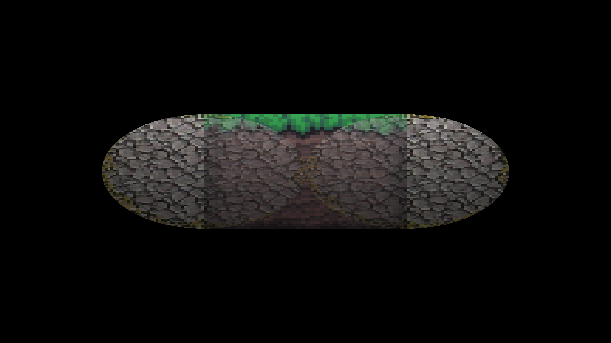

# Vox2D (archived)

2D constructive solid geometry with simple base shapes rendered via raytracing.
Supports textures via ASCII-based PPM. Supports rudimentary lighting.

#### A basic example featuring a union of base shapes, some textures and one point-light

